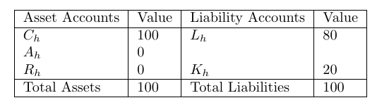
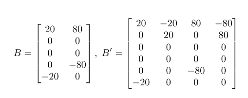
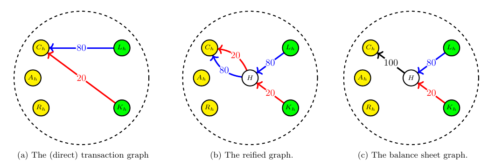
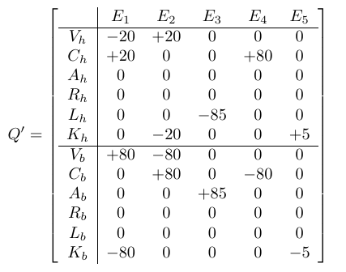
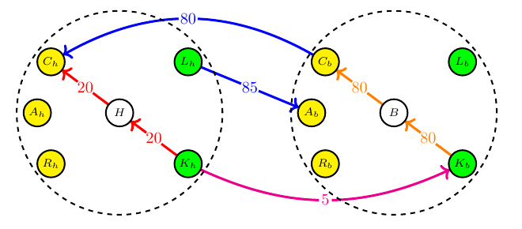
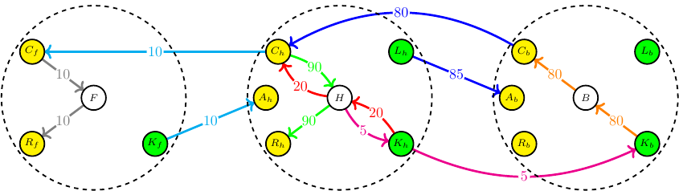

# AGE is an Accounting Graph Environment

The AGE project explores the representation of various accounting concepts using graph theory. 

## Background reading

The theoretical concepts underpinning the AGE code structure and functionality are documented in a number of white papers which are available in the *docs* directory.

* [WP19](docs/OpenRiskWP19_111125.pdf)

Further documentation (WIP) available on [Open Risk](https://www.openriskmanagement.com/documentation/age)

## About Accounting Graphs

Accounting graphs are mathematical representations of accounting using the tools of graph theory.

## Double-entry graphs

DEB graphs are representations of classic double entry accounting. E.g the classic balance sheet:

The core tool towards DEB graph representation is to express accounts and transactions as nodes and edges for an *incidence matrix*. There are two main forms of this matrix, the direct and *reified* version.

In both versions, each column of the matrix is a *balance vector* that sums to zero. For example a borrowing transaction would be represented as follows:

## Quadruple-entry graphs

The graph framework can be extended to accommodate multiple accounting entities that engage in transactions (and keep separate books). 

The incidence matrix has a block structure that compiles transactions both within and across different entities.

When multiple entities are present transactions are naturally split into the internal (within an entity's account) and external sets (linking two entities).

The incidence matrix representation offers a systematic way to mirror external transactions using internal edges and thus decompose the network into disjoint graphs (the opposite is generally not possible).

An arbitrary number of entities can be added.

## Persistence of Accounting Graphs

AGE supports two representations of accounting graphs. The first is an in-memory graph as a networkx MultiDiGraph object. The second is a relational database representation (sqlite) that is accessed via the Django ORM (object-relational model) and a number of Django classes (Entity, Account, Transaction). 

The typical workflow supported is that we fetch the graph from storage into a networkx object, work with the accounting graph in memory (analysis etc.) and store it when we are done. 

## Classification of accounts and transactions

Both Accounts and Transactions can be labeled with arbitrary labels (tags).

Networkx transactions (edges) have both a key (that identifies which transactions from a multi-edge set) and labels (that categorize transactions, e.g. "Purchases").

A set of predefined Account tags can be loaded to emulate existing accounting standards (e.g. IFRS). The meaning, logical relationships etc. of such tags and any restrictions they might impose on possible graph operations are not explicit. They are enforced by application code.

